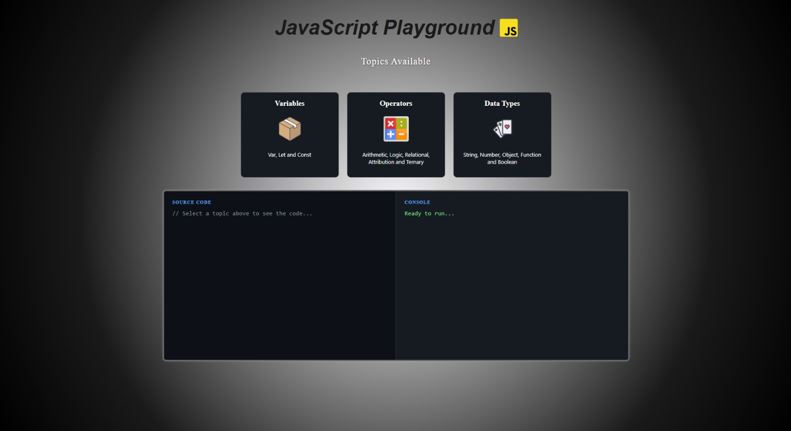
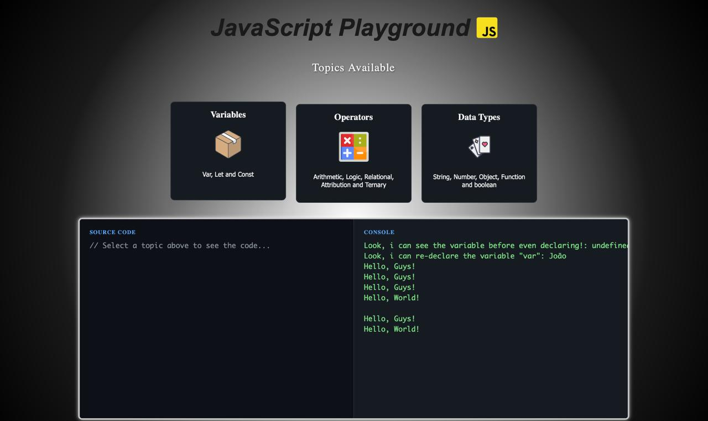
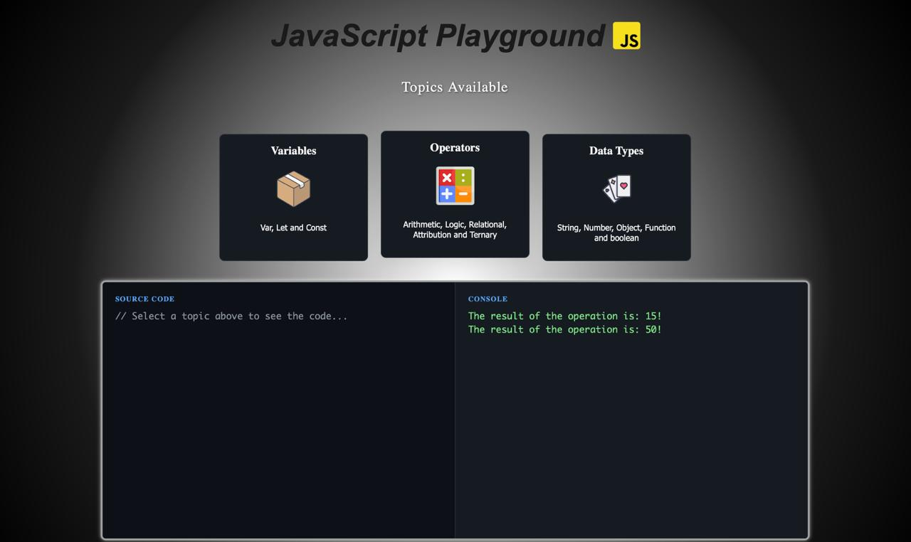
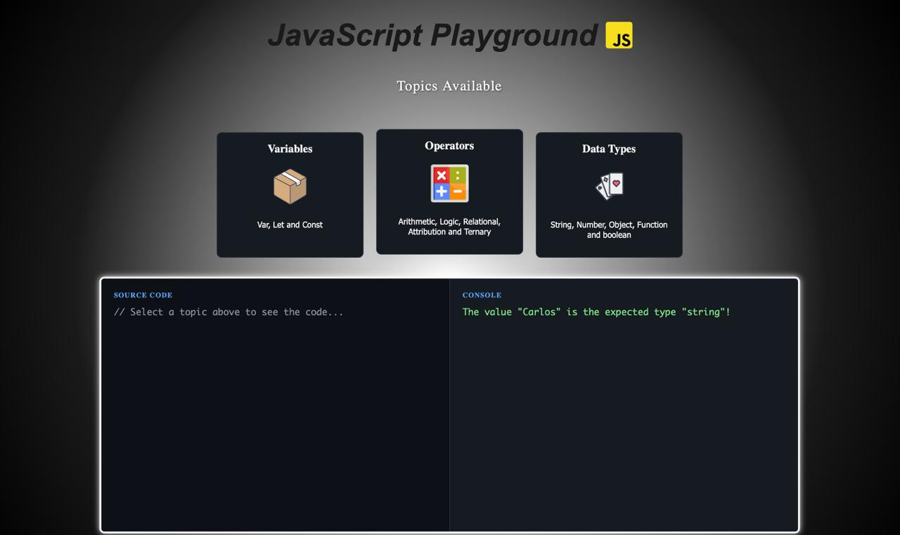

# 🎡 JavaScript Playground

---

## 🇺🇸 English Version

Welcome to the **Playground**! This is the interactive laboratory of our JavaScript journey. 🧪✨

Here, theory meets practice. It's a safe environment designed for you to run, test, and visualize the concepts learned in the modules, from basic variables to complex logic, all within a friendly interface.

### 📸 Preview & Demo

#### 1. 🏠 Home Screen
*Overview of the Playground interface, showing the available topic cards.*

#### 2. 📦 Variables Section
*Demonstration of declaring and using `var`, `let`, and `const`.*

#### 3. ➕ Operators in Action
*Visualizing arithmetic and logical operations results.*

#### 4. 🃏 Data Types
*Testing Data Types values.*

#### 5. 🎥 Full Site Demo
*A complete walkthrough of the site features and its responsive behavior.*
▶️ **[Watch the full demo video on YouTube](https://youtu.be/ICz9N9eiFtk)**

### 🚀 How to Run
1.  **Clone the repo** or download the project.
2.  Navigate to the `playground` folder.
3.  Open `index.html` in your browser.
4.  Click on the cards to execute the code examples!

---

## 🇧🇷 Versão em Português

Bem-vindo ao **Playground**! Este é o laboratório interativo da nossa jornada JavaScript. 🧪✨

Aqui, a teoria encontra a prática. É um ambiente seguro projetado para você rodar, testar e visualizar os conceitos aprendidos nos módulos, desde variáveis básicas até lógica complexa, tudo dentro de uma interface amigável.

### 📸 Visualização & Demo

#### 1. 🏠 Tela Inicial
*Visão geral da interface do Playground, mostrando os cartões de tópicos disponíveis.*

#### 2. 📦 Seção de Variáveis
*Demonstração de declaração e uso de `var`, `let` e `const`.*

#### 3. ➕ Operadores em Ação
*Visualizando resultados de operações aritméticas e lógicas.*

#### 4. 🃏 Tipos de Dados
*Testando diferentes tipos de dados.*

#### 5. 🎥 Demo Completa
*Um vídeo completo mostrando as funcionalidades do site e seu comportamento responsivo.*
▶️ **[Veja a demo completa do site diretamente no YouTube](https://youtu.be/ICz9N9eiFtk)**

### 🚀 Como Executar
1.  **Clone o repositório** ou baixe o projeto.
2.  Navegue até a pasta `playground`.
3.  Abra o arquivo `index.html` no seu navegador.
4.  Clique nos cartões para executar os exemplos de código!

---

> **🤖 Credits:** Most of the content was generated by AI, but the ideas and organization were done by me. The content was strongly influenced by **Gustavo Guanabara's Curso em Vídeo**.
